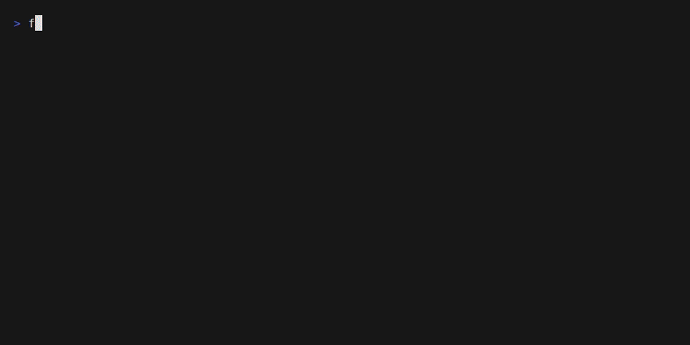

# farkle

A TUI for interactive dice roll tables in KCD2's farkle minigame.

The dice table data is pulled straight from the game files, rather than some out-of-date reddit posts.

You can sort dice based on face odds, effective odds including joker values, and overall raw weights. You can also select multiple faces and sort of combined probability.

### Sorting odds and switching to effective odds

Here you can see how to cycle through the different odds views and how to sort on different faces.

### Selecting multiple faces to sort on the combined odds

Here you can see how to select multiple faces and sort on the combined probability that you will get 1 of the selected faces.

## Controls

The keys are always listed along the bottom of the screen, and change hands between the two modes:

| Key | Single column | Multi-select |
| --- | --- | --- |
| `←` `→` (`h` `l`) | move the sort to another column | move the cursor to another face |
| `space` (`enter`) | reverse the sort | pick or unpick the face under the cursor |
| `r` | reverse the sort | reverse the sort |
| `tab` | cycle the view: face odds, effective odds, face weights | cycle the view, skipping face weights |
| `m` | switch to multi-select | back to single column |
| `↑` `↓` (`k` `j`) | scroll the table | scroll the table |
| `g` `G` (`home` `end`) | jump to the top or bottom | jump to the top or bottom |
| `q` (`esc`, `ctrl+c`) | quit | quit |

## Development

See [DEVELOPMENT.md](DEVELOPMENT.md) for the tooling, build and test setup, and [data/README.md](data/README.md) for how the dice data is extracted and processed from the KCD2 game files.
